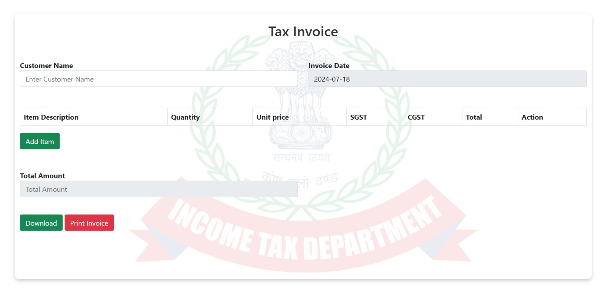
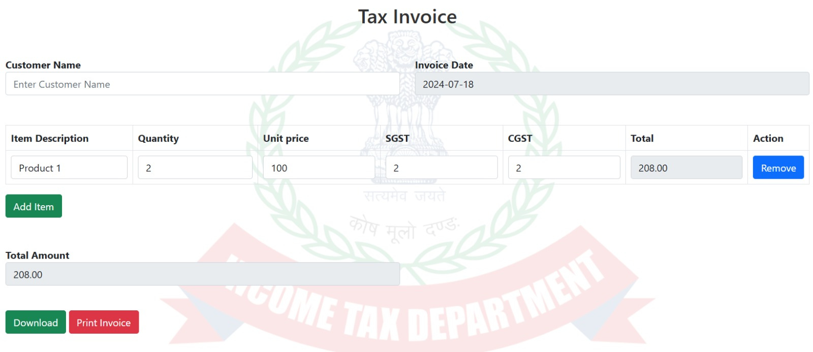
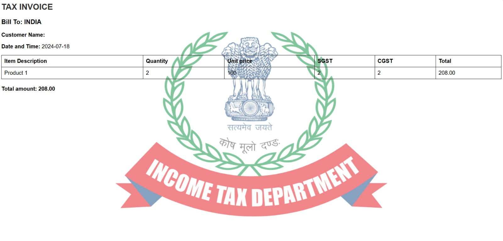
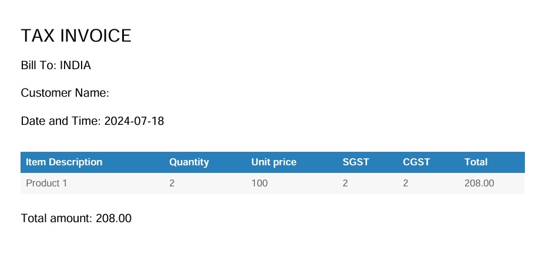

# Tax Billing (Printable & downloadable)
# Using HTML,CSS JS,JQUERY (Bootstrap for responsive)
### Screenshots

#### 1. Login Page

Description: This screenshot depicts the login page for the tax billing system.

#### 2. Main Page

Description: This screenshot shows the main page where users can manage their tax bills.

#### 3. Add Item

Description: This screenshot shows the interface for adding a new item to the tax bill.

#### 4. Print Format

Description: This screenshot illustrates the format in which the bill can be printed.

#### 5. Download Format

Description: This screenshot displays the format in which the bill can be downloaded.
